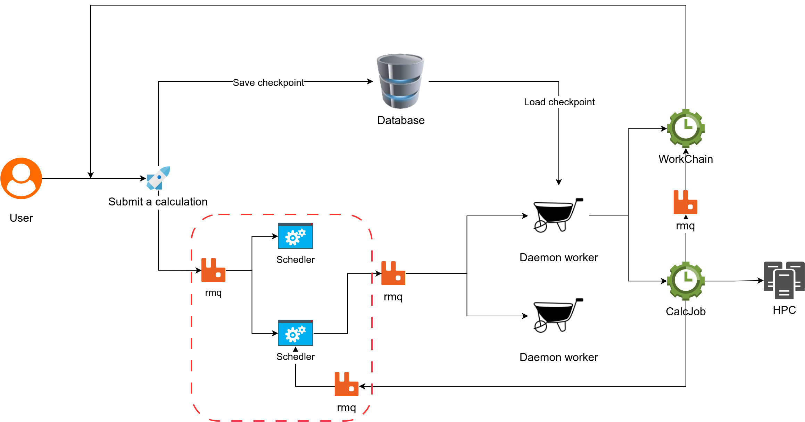

# AEP 010: Event‑based, multi‑instance process scheduler

| AEP number    | 010                                                       |
| ------------- | --------------------------------------------------------- |
| Title         | Event‑based, multi‑instance process scheduler             |
| Authors       | [Xing Wang](mailto:xingwang1991@gmail.com) (@superstar54) |
| Champions     | [Xing Wang](mailto:xingwang1991@gmail.com) (@superstar54) |
| Type          | S – Standard Track AEP                                    |
| Created       | 19‑June‑2025                                              |
| Status        | Draft                                                     |

---

## Table of Contents

1. [Background & Motivation](#background--motivation)
2. [Proposed Enhancement](#proposed-enhancement)

   * [Naming and Multi‑Instance Support](#naming-and-multi-instance-support)
   * [Scheduler Core](#scheduler-core)
   * [Daemonization via Circus](#daemonization-via-circus)
   * [CLI Extensions](#cli-extensions)
   * [Persistent State: `SchedulerNode`](#persistent-state-schedulernode)
   * [REST API Endpoints](#rest-api-endpoints)
   * [GUI Integration](#gui-integration)
3. [Detailed Design](#detailed-design)
4. [Implementation Reference](#implementation-reference)
5. [Backwards Compatibility](#backwards-compatibility)
6. [Alternatives Considered](#alternatives-considered)
7. [Unresolved Questions](#unresolved-questions)
8. [Future Work](#future-work)
9. [Conclusion](#conclusion)

---

## Background & Motivation

In the current **AiiDA** engine, the built‑in daemon runs every *runnable* process (CalcJob, WorkChain, etc.) as soon as it detects it. Many users, however, need **finer‑grained control over *when* processes start**—for example, to:

* enforce dynamic concurrency limits per HPC allocation;
* implement priority scheduling so urgent workflows start first; and
* obtain live visibility into queue state and utilisation in a GUI.

> **Important scope clarification**
> This proposal **does *not* attempt to change *where* a process runs**.
> The target computer, number of CPUs, partition, wall‑time, and any other resource parameters are immutable inputs of the AiiDA process and are therefore **sealed for provenance reasons**. The scheduler can *only* decide ***when*** those already‑defined processes are allowed to continue.

---

## Proposed Enhancement

We introduce an **event‑driven scheduler** implemented as a lightweight daemon that consumes `CONTINUE_PROCESS` tasks from RabbitMQ, honours user‑defined limits & priorities, and persists its state in the AiiDA database.
Multiple scheduler instances can run concurrently.

### Naming and Multi‑Instance Support

* Each scheduler is identified by a **user‑supplied name** (e.g. `eiger`, `merlin7-cpu`, `merlin7-gpu`). A common practice is to name it after an HPC *computer* to indicate the set of processes it is meant to *rate‑limit*, but this is **purely conventional**—it does **not** override the `Computer` *input* of the process itself.
* Users may create **any number of schedulers** to enforce different concurrency / priority policies for different groups of processes.
* Schedulers are stored as `SchedulerNode` instances (subclass of `Data`).

### Scheduler Core

* Subscribe to `CONTINUE_PROCESS` messages on RabbitMQ.

* Maintain per‑instance lists in the attached `SchedulerNode`:

  | Attribute                                        | Meaning                                                 |
  | ------------------------------------------------ | ------------------------------------------------------- |
  | `waiting_process`                                | FIFO (First-In, First-Out) list of processes waiting for capacity             |
  | `running_process`                                | Currently running processes, capped by limits           |
  | `next_priority`                                  | Decrementing counter so lower numbers ⇒ higher priority |
  | `max_processes`, `max_calcjobs`, `max_workflows` | User‑defined limits                                     |

* On capacity, pop the highest‑priority process from `waiting_process` and invoke `ProcessController.continue_process(pk)`.

* Detect process completion via RabbitMQ broadcasts (with database polling fallback) and update state.

### Daemonization via Circus

The CLI entry‑point:

| Command                               | Purpose                                                           |
| ------------------------------------- | ----------------------------------------------------------------- |
| `verdi scheduler start <name>`        | Start a single scheduler worker (handy for local tests)           |

Accept `--max‑*` flags to set limits at startup; the values are persisted in the `SchedulerNode` for hot‑reload.

### CLI Extensions

Under `verdi scheduler` we expose:

```
verdi scheduler list
verdi scheduler add <name>
verdi scheduler delete <name>
verdi scheduler start <name> [--max-processes N]
verdi scheduler stop <name>
verdi scheduler status <name>
verdi scheduler set‑max‑processes <name> N
verdi scheduler play‑processes <name> PK ...        # move to waiting queue
verdi scheduler set‑priority <name> PK PRIORITY
```

### Persistent State: `SchedulerNode`

A new subclass of `Data` with attributes listed above.

### REST API Endpoints

Mounted under `/plugins/scheduler/api` (FastAPI):

| Method | Path                           | Action                                          |
| ------ | ------------------------------ | ----------------------------------------------- |
| GET    | `/scheduler/list`              | List all schedulers                             |
| GET    | `/scheduler/{name}`            | Full scheduler detail including limits & counts |
| POST   | `/scheduler`                   | Create new scheduler                            |
| POST   | `/scheduler/{name}/start`      | Start worker(s)                                 |
| POST   | `/scheduler/{name}/stop`       | Stop worker(s)                                  |
| POST   | `/scheduler/{name}/set‑limits` | Update limits                                   |
| GET    | `/scheduler/{name}/processes`  | Paginated waiting/running table                 |

### GUI Integration

A React plugin for **aiida‑gui** provides:

* A **Scheduler list** (DataGrid) with start/stop buttons and live counts.
* A **Detail view** with editable limits and a real‑time line chart of running vs waiting processes.
* A **Process table** showing individual jobs with play/pause/kill & priority editing.

---

## Detailed Design

Figure 1 illustrates the interplay between user submission, RabbitMQ, the new Scheduler daemon, AiiDA daemon workers, and the database.
.

---

## Implementation Reference

A proof‑of‑concept lives in **aiida‑workgraph**:

* `engine/scheduler/scheduler.py` – core loop
* `orm/scheduler.py` – `SchedulerNode`
* `cli/cmd_scheduler.py` – CLI group
* `plugins/scheduler/api.py` – REST router
* `frontend/src/plugins/Scheduler` – GUI components

---

## Backwards Compatibility

* The default AiiDA daemon behavior is unchanged; the new scheduler is available if you choose to use it.
* WorkChain usage caveat. To run WorkChains under a scheduler, developers must either (i) call submit_to_scheduler from aiida_workgraph.utils.control or (ii) override the WorkChain’s submit method so the process is enqueued with the chosen scheduler. This update must also be applied recursively to any nested WorkChains, followed by restarting the AiiDA daemon. Processes that omit these steps will be handled by the standard daemon queue and fall outside the scheduler’s tracking.
* Currently, the command verdi process repair will send the stuck processes to the normal AiiDA daemon worker queue, instead of the scheduler. This destroys the scheduler’s ability to track the processes.

---

## Alternatives Considered

| Option                        | Drawbacks                                        |
| ----------------------------- | ------------------------------------------------ |
| `aiida‑submission‑controller` | No live interaction, no priorities, no GUI hooks |
| Refactor the `aiida-core`     | would require significant changes                |

---

## Future Work

* Allow **moving processes** between scheduler instances by duplicating the `CONTINUE_PROCESS` task metadata (while keeping provenance intact).
* A workflow can submit different types of processes (CalcJob, WorkChain, etc.) to different schedulers.
* Allow more complex rules for **dynamic limits** (e.g. based on current queue length, time of day, etc.).
* Daemon repair workflow. Make vein the rdi process repair scheduler‑aware so that repaired/stuck processes are re‑queued to their owning scheduler instead of the default daemon queue, preventing loss of tracking or duplicated runs.

---

## Conclusion

This AEP specifies a **multi‑instance, event‑driven scheduler** that controls ***when*** AiiDA processes continue, without touching their immutable resource inputs. The design is self‑contained, backwards compatible, and unlocks advanced queue‐management features requested by the community.
