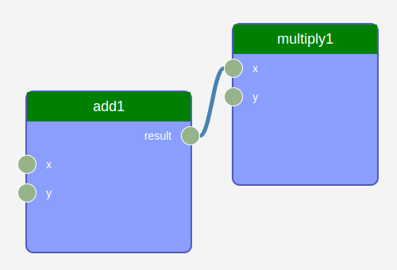

# AEP 010: Introducing the `WorkGraph` in AiiDA

| AEP number | 010                                                          |
|------------|--------------------------------------------------------------|
| Title      | Introducing the `WorkGraph` in AiiDA                         |
| Authors    | [Xing Wang](mailto:xingwang1991@gmail.com) (superstar54)     |
| Champions  | [Xing Wang](mailto:xingwang1991@gmail.com) (superstar54)     |
| Type       | S - Standard Track AEP                                       |
| Created    | 29-Nov-2024                                                  |
| Status     | Draft                                                        |


## Table of Contents

1. [Background](#background)  
2. [Proposed Enhancement](#proposed-enhancement)  
   - [Key Concepts](#key-concepts)  
     - [Task](#task)  
     - [Input and Output Socket](#input-and-output-socket)  
     - [WorkGraph](#workgraph)  
   - [Engine](#engine)  
   - [Graphical User Interface](#graphical-user-interface)  
   - [Database Integration](#database-integration)  
3. [Example Usage](#example-usage)  
   - [WorkChain Version](#workchain-version)  
   - [WorkGraph Version](#workgraph-version)  
4. [Design Considerations](#design-considerations)  
   - [Advantages over `WorkChain`](#advantages-over-workchain)  
   - [When to Use `WorkGraph`](#when-to-use-workgraph)  
   - [When to Use `WorkChain`](#when-to-use-workchain)  
5. [Pros and Cons](#pros-and-cons)  
   - [Pros](#pros)  
   - [Cons](#cons)  
6. [Conclusion](#conclusion)


## Background

AiiDA is a powerful platform for managing computational workflows and ensuring data provenance. It includes two built-in workflow components: `WorkFunction` and `WorkChain`. While `WorkFunction` is straightforward to use, it lacks automatic checkpointing, making it unsuitable for long-running calculations. `WorkChain` supports automatic checkpointing and is recommended for complex workflows. However, it has limitations:

- **Complex Implementation**: Developing `WorkChain` workflows requires advanced Python skills due to its complexity.
- **Lack of Flexibility**: `WorkChain` is less flexible for different use cases, often necessitating the creation of new workflows for each unique task sequence.

These limitations can be likened to planning train journeys where each unique route requires a new train line, leading to redundancy and inefficiency. To address these challenges, we propose introducing a new workflow component called `WorkGraph`.

## Proposed Enhancement

Introduce the `WorkGraph` component in AiiDA, which simplifies workflow creation and enhances flexibility. `WorkGraph` allows users to design workflows by connecting tasks in a directed acyclic graph (DAG), enabling more intuitive and flexible workflow management.

### Key Concepts

#### Task

A **Task** is the basic building block of a `WorkGraph`. It encapsulates an executable unit with inputs, outputs, and an executor. The executor can be a `calcfunction`, `workfunction`, `CalcJob`, `WorkChain`, or any other Python function. All AiiDA components can be automatically converted into tasks for use in `WorkGraph`.

Here is an example of defining a task using a decorator:

```python
@task.calcfunction
def multiply(x, y):
    return x * y
```

Here is an example of using the AiiDA components directly as tasks:

```python
from aiida_quantumespresso.calculations.pw import PwCalculation
wg.add_task(PwCalculation, name="pw_scf")
```

#### Input and output socket

In `WorkGraph`, **Sockets** represent the data interfaces of a Task. They define the types of data that can be transferred between tasks. Sockets are typically generated automatically based on the function arguments or inherited from the **ports** of AiiDA components like `WorkChain`. In graphical interfaces, a socket may have property that allow data visualization and direct data input or editing. Property can be simple data types like integers, strings, or booleans, as well as more complex data types like 3D atomic structures.

#### WorkGraph

A **WorkGraph** is a collection of Tasks and the links (dependencies) between them, forming a DAG. It enables users to construct workflows by defining how data flows between tasks.

**Creating a WorkGraph:**

```python
from aiida_workgraph import WorkGraph

wg = WorkGraph(name="example_workflow")
```

**Adding Tasks:**

```python
wg.add_task(add, name="add")
wg.add_task(multiply, name="multiply")
```

**Linking Tasks:**
Add task dependencies by connecting the sockets of tasks.
```python
wg.add_link(wg.tasks["add"].outputs["result"], wg.tasks["multiply"].inputs["x"])
```

### Engine
The `WorkGraphEngine` class is responsible for executing the workflow. It is designed to handle the following features:

- **Dependency-Based Execution**: Tasks are executed as soon as all their input dependencies are satisfied, allowing for parallel execution of independent tasks.
- **Automatic Checkpointing**: The state of the workflow is saved periodically, enabling recovery from interruptions.

The `WorkGraphEngine` share similar design with `WorkChain` but also has some unique features.

Same design:
- **State Machine**: The engine transitions between different states (e.g., CREATED, RUNNING, WAITING, FINISHED) during execution. And save checkpoint at each state transition.
- **Context**: The engine maintains a context that stores the internal data of the workflow.
- **Submit and Wait**: The engine submit the AiiDA process and construct the `Awaitable` object which has callback function to resume the workflow execution.

Unique features:
- **Resume immediately**: The engine will resume from `WAITTING` state to `RUNNING` state immediately when an `Awaitable` object is terminated. While in `WorkChain`, the engine will wait for all `Awaitable` objects to be terminated before resuming.
- **Automatic Execution**: The engine automatically detects the ready tasks and executes them in parallel. In the `WorkChain`, the execution steps are defined in the `outline`.


### Graphical User Interface

The `WorkGraph` component can be visualized using a graphical user interface (GUI) that displays the workflow graph, tasks, and connections. We chose to use the [rete.js](https://retejs.org/) library, which provides a flexible and interactive interface for creating and editing workflows.



### Database Integration
The data (tasks, connections, and execution status) of a `WorkGraph` are stored in the `extras` field of an AiiDA process node. In this way, one can reload the `WorkGraph` from the database.

## Example Usage

Let's show this by an example. Suppose we want to calculate ```(x + y) * z ``` in two steps:

- add `x` and `y`.
- then multiply the result with `z`.

Let's first define the calcfunctions for addition and multiplication:

```python
from aiida.engine import calcfunction

@calcfunction
def add(x, y):
    return Int(x + y)

@calcfunction
def multiply(x, y):
    return Int(x * y)
```

#### WorkChain version

```python
from aiida.engine import WorkChain, run_get_node
from aiida.orm import Int

class AddMultiplyWorkChain(WorkChain):

    @classmethod
    def define(cls, spec):
        super().define(spec)
        spec.input('x')
        spec.input('y')
        spec.input('z')
        spec.outline(
            cls.add,
            cls.multiply,
            cls.results,
        )
        spec.output('result')

    def add(self):
        self.ctx.sum = add(self.inputs.x, self.inputs.y)

    def multiply(self):
        self.ctx.product = multiply(self.ctx.sum, self.inputs.z)

    def results(self):
        self.out('result', self.ctx.product)


# Run the workchain
result, node = run_get_node(AddMultiplyWorkChain, x=Int(1), y=Int(2), z=Int(3))
```


#### WorkGraph version

```python
from aiida_workgraph import task, WorkGraph
from aiida.orm import Int

wg = WorkGraph("add_multiply")
wg.add_task(add, name="add")
wg.add_task(multiply, name="multiply")
wg.add_link(wg.tasks["add"].outputs[0], wg.tasks["multiply"].inputs["x"])

wg.run(inputs = {"add": {"x": Int(1),
                            "y": Int(2)},
                    "multiply": {"y": Int(3)}},
        )
```

Both the WorkChain and WorkGraph implementations achieve the same result. However, the WorkGraph version requires less boilerplate code and utilizes a simpler Python grammar.

### Modification of WorkGraph

One of the significant advantages of `WorkGraph` is its flexibility in modifying the workflow. Users can easily add, remove, or modify tasks and dependencies without the need to rewrite the entire workflow. This feature is particularly useful for rapid prototyping and customization of workflows.

For example, to add a new task `divide` to the existing workflow:

```python
@calcfunction
def divide(x, y):
    return Int(x / y)

wg.add_task(divide, name="divide")
wg.add_link(wg.tasks["add"].outputs[0], wg.tasks["divide"].inputs["x"])
```

## Design Considerations

### Advantages over `WorkChain`

- **Simplified Syntax**: Less boilerplate code and simpler Python syntax.
- **Flexibility**: Easily add or modify tasks and dependencies.
- **Parallel Execution**: Optimizes resource utilization by executing independent tasks concurrently.

### When to Use `WorkGraph`

- **Data-Driven Workflows**: Ideal when the workflow involves connecting outputs to inputs without complex control structures.
- **Flexible Workflow Design**: Suitable when workflows need to be frequently modified or extended.
- **Rapid Prototyping**: Allows for quick assembly of workflows without deep knowledge of AiiDA internals.

### When to Use `WorkChain`

- **Complex Control Flows**: Preferable when workflows require intricate control structures like loops and conditionals.
- **BaseRestartWorkflows**: Base restart workflows are still best implemented using `WorkChain`.

## Pros and Cons

### Pros

- **Lower Barrier to Entry**: Simplifies workflow creation, making AiiDA more accessible.
- **Enhanced Flexibility**: Easily customize and extend workflows.
- **Efficient Resource Utilization**: Optimizes execution through parallelism.
- **Intuitive Design**: Aligns with natural human logic.

### Cons

- **Less Suitable for Complex Control Flows**: Not ideal for workflows requiring advanced control structures.
- **Potential Complexity in Large Graphs**: Managing very large workflows may become challenging.

## Conclusion

The introduction of `WorkGraph` enriches AiiDA's workflow ecosystem by providing a flexible and user-friendly alternative to `WorkChain`. It empowers users to construct workflows that closely mirror their logical thought processes, reduces the complexity of implementation, and enhances resource utilization through parallel execution.

By distinguishing between AiiDA users and developers, `WorkGraph` allows developers to focus on creating foundational `WorkChains` (akin to essential train routes), while users can effortlessly compose and customize workflows to meet their specific needs without delving into complex development tasks.